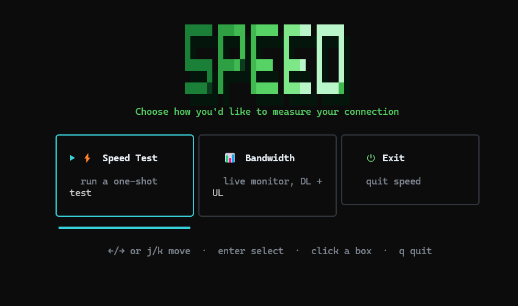
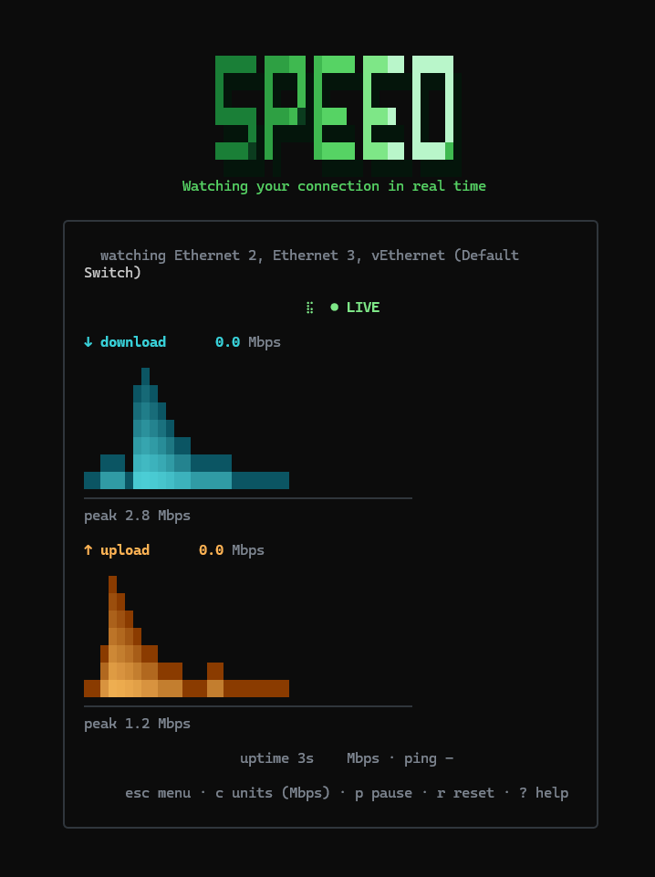

# speed

> A polished terminal tool for measuring — and watching — your internet
> connection, written in Go.

`speed` opens with a small **startup menu** so you can choose between two
modes:

- **Speed Test** — a one-shot run that measures **download**, **upload**, and
  **latency/ping**, ending in a compact summary with peak rates.
- **Bandwidth Monitor** — a **live** view of your real network traffic (it
  reads the OS interface counters, generating no test traffic of its own),
  showing download + upload continuously with all-time peaks, an uptime
  counter, and pause/reset.

Both modes render a centered card UI with live progress and smooth
gradient graphs.


---

## Screenshots

| Main menu                          | Speed Test (in progress)          | Finished (summary)                |
| ---------------------------------- | --------------------------------- | --------------------------------- |
|   |           |   |

| Bandwidth Monitor                  | Help menu (`?`)                    |
| ---------------------------------- | ---------------------------------- |
|  |   |

- **Main menu** — pick a mode: Speed Test, Bandwidth Monitor, or Exit.
  Navigate with the keyboard or click a box.
- **Speed Test** — the centered card with the live `SPEED` header,
  download/upload gradient graphs, and a spinner while servers are found.
- **Finished** — the final summary with peak download/upload rates and ping.
- **Bandwidth Monitor** — live download + upload of your real connection,
  with all-time peaks and an uptime line. `● LIVE` while running, `Ⅱ PAUSED`
  when paused.
- **Help menu** — press `?` in either mode to see the live controls.


[](https://github.com/Foxemsx/speed)
[](https://github.com/Foxemsx/speed)
[](https://github.com/Foxemsx/speed)
Runs on Linux and Windows terminals. Any other OS supported by Go should work
too.

---

## Features

- **Startup menu** — choose Mode (Speed Test / Bandwidth Monitor / Exit) from
  a centered row of cards; move with `←/→` or `j/k`, `enter` to select, or
  click a box directly.
- **Speed Test** — download, upload, and ping in a single run.
- **Bandwidth Monitor** — watches your PC's real network traffic continuously
  (no synthetic load) until you leave, tracking all-time peaks and uptime.
- **Parallel connections** (~5) to saturate your link, like fast.com.
- **Centered, rounded-border card** that reflows on resize and looks good at
  any terminal size.
- **Distinct accent colors** for download (teal) vs upload (amber), with a
  small reskinnable theme.
- **Live gradient graphs** for download and upload — vertical bars shaded
  dark-at-base → bright-at-tip, so throughput spikes stand out, refreshed
  every ~100 ms.
- **Smooth interpolation** (lerp) so the numbers and bars glide instead of
  snapping.
- **Phase progression** (Speed Test): finding servers (spinner) → download →
  upload → latency → a one-line summary with peak values.
- **Live controls** while the test/monitor runs:
  - `c` — cycle units (Mbps / KB/s / MB/s / GB/s)
  - `r` — restart the test / monitor
  - `p` — pause / resume the monitor (Bandwidth Monitor only)
  - `?` — toggle the help overlay
  - `esc` / `m` — back to the main menu
  - `q` / `ctrl+c` — quit (cancels in-flight transfers).
- **Graceful errors**: no internet / network failures show a clear message,
  never a stack trace.

---

## Installation

`speed` is distributed as a single static binary — no runtime dependencies.

### Prerequisites

You only need the **Go toolchain (1.23 or newer)** to install. Download it
from <https://go.dev/dl/>. Verify the install with:

```sh
go version   # should print go1.23 or later
```

> After installing Go, make sure `$GOPATH/bin` (usually `~/go/bin` on Linux,
> `%USERPROFILE%\go\bin` on Windows) is on your `PATH`, so the `speed`
> command is reachable after install. On most setups the official Go
> installer adds it for you.

### Interactive installer (easiest)

A single self-contained script with a friendly, beginner-friendly TUI. It
detects whether you have Go, explains what it is (and downloads it locally to
`~/.local/go` if you don't — **no sudo needed**), then installs `speed` with a
polished progress screen and a completion summary. Works on **bash, zsh, and
fish**.

```sh
curl -fsSL https://raw.githubusercontent.com/Foxemsx/speed/main/install.sh | sh
```

After it finishes, just run:

```sh
speed
```

> **Note:** the installer runs on Linux/macOS. Windows users should use
> Option 1 below (or `winget` if a package becomes available).

### Interactive uninstaller

The same beginner-friendly TUI, for removing `speed`. It removes **only the
`speed` binary** (`~/go/bin/speed`) and leaves the Go toolchain and your `PATH`
untouched. It asks for confirmation before doing anything.

```sh
curl -fsSL https://raw.githubusercontent.com/Foxemsx/speed/main/uninstall.sh | sh
```

> **Note:** also Linux/macOS only. If `speed` is not found, it tells you and
> exits without removing anything.

### Option 1 — `go install` (recommended)

This compiles and installs the latest release into your Go bin directory in
one step.

**Linux / macOS**

```sh
go install github.com/Foxemsx/speed@latest
```

Then run it from anywhere:

```sh
speed
```

If `speed` isn't found, add Go's bin directory to your `PATH`:

```sh
# bash / zsh — add to ~/.bashrc or ~/.zshrc
export PATH="$PATH:$(go env GOPATH)/bin"
```

```sh
# fish — run once; fish_add_path persists it and de-duplicates
fish_add_path (go env GOPATH)/bin
```

**Windows (PowerShell)**

```powershell
go install github.com/Foxemsx/speed@latest
```

Go installs the binary to `%USERPROFILE%\go\bin\speed.exe`. To run it from any
folder, add that directory to your `PATH`:

```powershell
# Run once in an admin PowerShell, then restart the terminal
$env:Path += ";$env:USERPROFILE\go\bin"
[Environment]::SetEnvironmentVariable("Path", $env:Path, "User")
```

Then:

```powershell
speed
```

### Option 2 — Build from source

Use this if you don't have `go install` set up, want a local tweak, or prefer
to build manually.

```sh
git clone https://github.com/Foxemsx/speed
cd speed
go build -o speed .      # on Windows: go build -o speed.exe .
```

Run the binary from the folder you built it in:

```sh
./speed        # Linux / macOS
.\speed.exe    # Windows
```

To make it available everywhere, copy the resulting binary into a folder on
your `PATH` (for example `/usr/local/bin` on Linux).

### Arch Linux

There is no Arch package in the repository yet — use **Option 1** or
**Option 2** above. Note that `go install` places the binary in `~/go/bin`, and
the Go installer does **not** add that to your shell's `PATH` automatically (this
is especially easy to miss on the fish shell). Make sure `~/go/bin` is on your
`PATH` as described in the previous section, then run `speed`.

---

## Usage

```sh
speed   # opens the startup menu; pick Speed Test or Bandwidth Monitor
```

Launch `speed` with no arguments to open the **main menu**, then choose a
mode. Each mode has its own live controls (see below). From anywhere,
`esc` / `m` returns to the menu and `ctrl+c` quits.

### Flags

| Flag      | Description                                                                       | Default   |
| --------- | --------------------------------------------------------------------------------- | --------- |
| `--theme` | Color theme name. Currently only `default`. Reserved for future palettes.         | `default` |

### Speed Test controls

| Key       | Action                                            |
| --------- | ------------------------------------------------- |
| `c`       | cycle units (Mbps / KB/s / MB/s / GB/s)           |
| `r`       | restart the test                                 |
| `?`       | toggle the help overlay                          |
| `esc`/`m` | back to the menu                                 |
| `q`       | quit (cancels the in-flight test)                |

### Bandwidth Monitor controls

| Key       | Action                                            |
| --------- | ------------------------------------------------- |
| `c`       | cycle units (Mbps / KB/s / MB/s / GB/s)           |
| `p`       | pause / resume the monitor                        |
| `r`       | restart the monitor                              |
| `?`       | toggle the help overlay                          |
| `esc`/`m` | back to the menu                                 |
| `q`       | quit                                             |

---

## License

Released under the [MIT License](LICENSE). Free to use, modify, and
redistribute, provided the copyright notice and license text are included.
